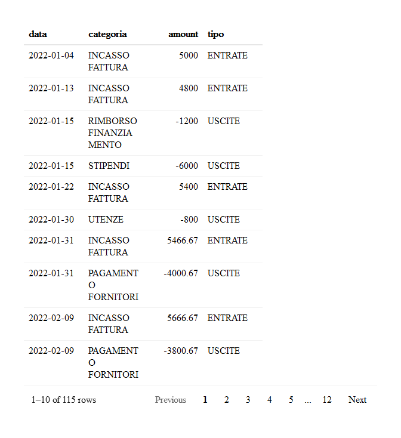
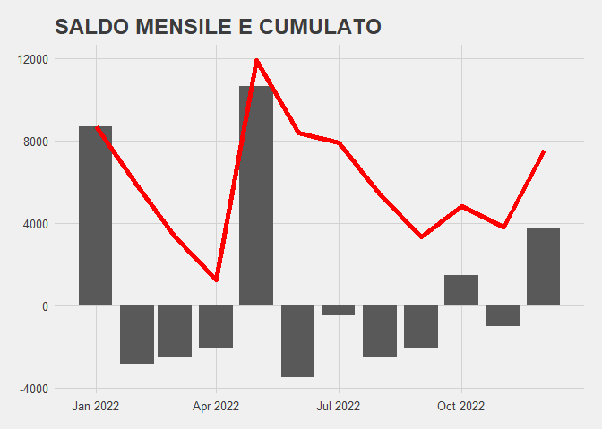
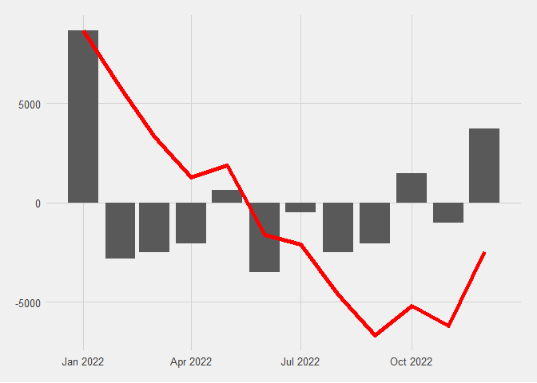
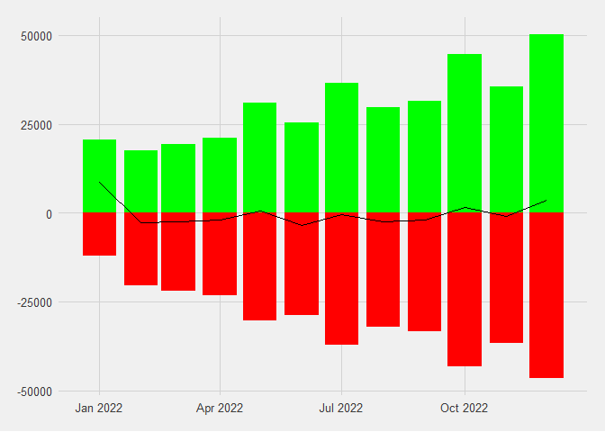
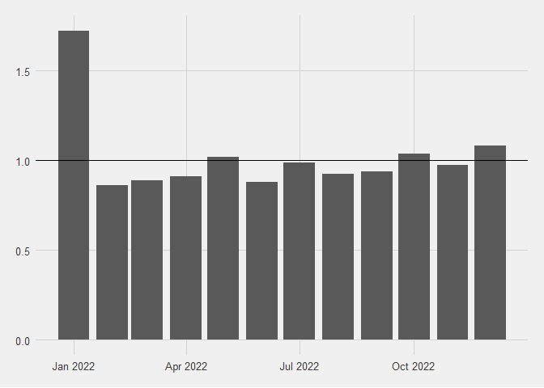
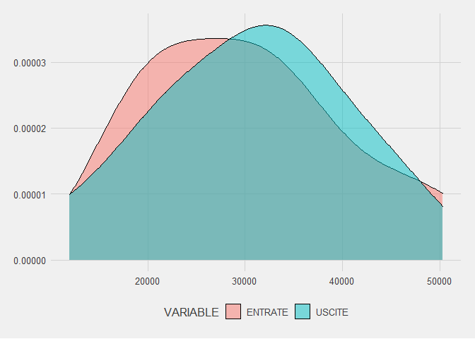

Utilizzo Dati Transazionali
================
Alejandro Abraham

## Introduzione

Lo scopo e’ quello di utilizzare i dati **transazionali** in modo di
migliorare l’algoritmo di merito creditizio. Mentre che attualmente si
usano dati di bilancio principalmente, mediante i trasazionali e’
possibile di intercettare comportamenti (i.e. utilizzo della cassa,
ciclo delle fatture) che possano dare una visione di “responsabilita’” o
allarme di “liquidity crunch”.

#### In questa linea due sviluppi sono possibili:

- Automazzione dell’offering commerciale: contattare al cliente
  anticipatamente sull possibile bisogno di liquidita’

- **Aggiungere al calcolo del merito creditizio il rischio della
  liquidita’ in conto corrente in base al ciclo di** *ENTRATE / USICTE*
  **mensili e la loro distribuzione**.

In questo documento analizziamo brevemente il secondo caso.

## Data Preparation

``` r
# Setup ============================================================

## 1. Package loading --------------------------------------

library(data.table)
library(skimr)
library(ggplot2)
library(ggthemes)
library(reactable)

theme_set(theme_fivethirtyeight())


## 2. Data loading -----------------------------------------

dt_tr = fread(file.path('data', 'transazioni_test.csv'))


## 3. Data Cleaning -----------------------------------------

### We analyze the column classes
dt_tr_classes = unlist(lapply(dt_tr, class))
dt_tr_classes
```

    ##        data   categoria      amount 
    ## "character" "character" "character"

``` r
### Transform
dt_tr[, data := as.Date(data, "%d/%m/%Y")]

dt_tr[, amount := gsub("€", "", amount)]
dt_tr[, amount := gsub("\\.", "", amount)]
dt_tr[, amount := gsub(",", ".", amount)]
dt_tr[, amount := gsub(",", ".", amount)]
dt_tr[, amount := gsub(" ", "", amount)]
dt_tr[, amount := as.numeric(amount)]

### Labeling

dt_tr[, tipo := fifelse(categoria %chin% c('INCASSO FATTURA', 'EROGAZIONE FINANZIAMENTO'), 'ENTRATE', 'USCITE')]

setkey(dt_tr, data, categoria)

dt_tr_classes = unlist(lapply(dt_tr, class))
dt_tr_classes
```

    ##        data   categoria      amount        tipo 
    ##      "Date" "character"   "numeric" "character"

``` r
reactable(dt_tr)
```

<!-- -->

## Exploratorty Data Analysis

### General Overview of Variables and Anomaly Detection

``` r
skimr::skim_without_charts(dt_tr)
```

|                                                  |                 |
|:-------------------------------------------------|:----------------|
| Name                                             | dt_tr           |
| Number of rows                                   | 115             |
| Number of columns                                | 4               |
| Key                                              | data, categoria |
| \_\_\_\_\_\_\_\_\_\_\_\_\_\_\_\_\_\_\_\_\_\_\_   |                 |
| Column type frequency:                           |                 |
| character                                        | 2               |
| Date                                             | 1               |
| numeric                                          | 1               |
| \_\_\_\_\_\_\_\_\_\_\_\_\_\_\_\_\_\_\_\_\_\_\_\_ |                 |
| Group variables                                  | None            |

Data summary

**Variable type: character**

| skim_variable | n_missing | complete_rate | min | max | empty | n_unique | whitespace |
|:--------------|----------:|--------------:|----:|----:|------:|---------:|-----------:|
| categoria     |         0 |             1 |   6 |  24 |     0 |        7 |          0 |
| tipo          |         0 |             1 |   6 |   7 |     0 |        2 |          0 |

**Variable type: Date**

| skim_variable | n_missing | complete_rate | min        | max        | median     | n_unique |
|:--------------|----------:|--------------:|:-----------|:-----------|:-----------|---------:|
| data          |         0 |             1 | 2022-01-04 | 2022-12-30 | 2022-07-03 |       62 |

**Variable type: numeric**

| skim_variable | n_missing | complete_rate | mean |   sd |    p0 |   p25 |   p50 |  p75 |  p100 |
|:--------------|----------:|--------------:|-----:|-----:|------:|------:|------:|-----:|------:|
| amount        |         0 |             1 |   65 | 7257 | -9434 | -6209 | -1200 | 7367 | 12867 |

``` r
unique_voices = unique(dt_tr$categoria)

unique_voices
```

    ## [1] "INCASSO FATTURA"          "RIMBORSO FINANZIAMENTO"  
    ## [3] "STIPENDI"                 "UTENZE"                  
    ## [5] "PAGAMENTO FORNITORI"      "EROGAZIONE FINANZIAMENTO"
    ## [7] "PAGAMENTO FATTURA"

#### Sanity Check

- Il dataset non ha `missing_values`.

- Il *time frame* e’ di 1 anno calendario

- Valori *negativi* sono ***USCITE*** e i *positivi* **ENTRATE** (non
  costi / ricavi)

  - I valori sono verosimili (asenza di *outliers* o *errori* evidenti)

------------------------------------------------------------------------

## Account Behavior Analysis

L’analisi a continuazione ci consente di vedere il comportamento del
conto del soggetto nel tempo (vista mensile).

``` r
## Monthly SALDO

dt_tr_month = dt_tr[, .(sum = sum(amount)), by = .(year = format(data, "%Y"), month = format(data, "%m"))]
dt_tr_month[, cum_sum := cumsum(sum)]
dt_tr_month[, data := paste(year, month, '01', sep = '-')]
dt_tr_month[, data := as.Date(data)]

dt_tr_month |> 
    ggplot(aes(x = data)) +
    geom_col(aes(y = sum)) +
    geom_line(aes(y = cum_sum),
              color = 'red', size = 2) +
    ggtitle('SALDO MENSILE E CUMULATO')
```

<!-- -->

Il primo insight e’ che ci sono **tre momenti di grandi incassi**,
mentre che il resto dell’anno le uscite superano le entrate. Dalle voci
transazionali dobbiamo pero’ togliere le richeste di prestiti per capire
la sostenibilita’ di questo comportamento.

``` r
## Monthly SALDO without FINANZIAMENTO
dt_tr_wof = dt_tr[!categoria %in% c('EROGAZIONE FINANZIAMENTO')]
dt_tr_month_wof = dt_tr_wof[, .(sum = sum(amount)), by = .(year = format(data, "%Y"), month = format(data, "%m"))]
dt_tr_month_wof[, cum_sum := cumsum(sum)]
dt_tr_month_wof[, data := paste(year, month, '01', sep = '-')]
dt_tr_month_wof[, data := as.Date(data)]

dt_tr_month_wof |> 
    ggplot(aes(x = data)) +
    geom_col(aes(y = sum)) +
    geom_line(aes(y = cum_sum),
              color = 'red', size = 2) 
```

<!-- -->

#### Preliminary Insights

Osserviamo che mensilmente c’e un comportamento stabile nei costi (che
si potrebbe approfondire le diverse voci come integrarli
strutturalmente) mentre che per i ricavi ci sono momenti di forte
incasso.  
**I primi spunti sono:**

- Saldo del conto corrente sempre positivo, il che vuol dire attenzione
  alla disponibilita’ di cassa.

- Nonostante la mancanza di entrate durante l’anno, il bisogno di
  liquidita’ non e’ allarmante.

- La azienda sembra di avere una liquidita’ stabile, ben gestita grazie
  alll’utilizzo di prestiti di corto termine.

``` r
## Monthly Analisi Liquidity
 
dt_tr_l = dt_tr[categoria != 'EROGAZIONE FINANZIAMENTO']
dt_tr_l = dt_tr_l[, .(amount = sum(amount)), by = .(year = format(data, "%Y"), month = format(data, "%m"), tipo)]
dt_tr_l[, data := paste(year, month, '01', sep = '-')]
dt_tr_l[, data := as.Date(data)]
dt_tr_l = dt_tr_l[, .(data, amount, tipo)]
dt_tr_l = dcast(dt_tr_l[, .(data, amount, tipo)], data ~ tipo, value.var = 'amount')
dt_tr_l[, MONTHLY_DELTA := ENTRATE + USCITE]
dt_tr_l[, RAPPORTO := ENTRATE / -USCITE]

dt_tr_l |> 
    ggplot(aes(x = data)) +
    geom_col(aes(y = ENTRATE), fill = 'green') +
    geom_col(aes(y = USCITE), fill = 'red') +
    geom_line(aes(y = MONTHLY_DELTA))
```

<!-- -->

#### Insight

Dalla seconda vista mensile (non per saldo ma paragonando ENTRATE E
USCITE) un punto importante da sollevarsi e’ che c’e una coordinazione
del “Livello” del flusso di cassa. In altre parole, nei messi di entrate
minori, il volume di uscite e anche basso. Questo puo’ rappresentare una
gestione Economico e Finanziaria (Produzione e Contabilita’) ben
coordinata, segno di management preparato.

## Proposal:

Utilizzo dei transazionali per Quantificazione del rischio “Liquidity
Crunch”: Rapporto **ENTRATE/USCITE**

<div class="callout-note">

Analizzando i macrogruppi *ENTRATE e USCITE* riusciamo a creare un proxy
sul rischio di **Liquidity Crunch**.

Le ipotesi sono:

- E’ positivo avere ENTRATE in media simile alle USCITE

- E’ positivo avere una deviazione standard delle ENTRATE e le USICTE
  bassa

- E’ positivo avere un accoppiamento dei livelli (quando le USCITE
  crescono, le ENTRATE anche

</div>

``` r
dt_tr_l |> 
    ggplot(aes(x = data)) +
    geom_col(aes(y = RAPPORTO)) +
    geom_hline(yintercept  = 1)
```

<!-- -->

``` r
# MEDIA
dt_tr_l_plot = melt(dt_tr_l[, USCITE := -USCITE], id.vars = 'data', measure.vars = c('ENTRATE', 'USCITE'), variable.name = 'VARIABLE', value.name = 'VALUE') 

dt_tr_l_plot |> 
    ggplot(aes(x = VALUE, fill = VARIABLE)) +
    geom_density(alpha = 0.5) 
```

<!-- -->

``` r
dt_tr_l[, lapply(.SD, mean), .SDcols = c('ENTRATE', 'USCITE', 'RAPPORTO')]
```

    ##    ENTRATE USCITE RAPPORTO
    ## 1:   30294  30501        1

``` r
# MEDIAN
dt_tr_l[, lapply(.SD, median), .SDcols = c('ENTRATE', 'USCITE', 'RAPPORTO')]
```

    ##    ENTRATE USCITE RAPPORTO
    ## 1:   30333  31273     0.96

``` r
# STANDARD DEVIATION
dt_tr_l[, lapply(.SD, sd), .SDcols = c('ENTRATE', 'USCITE', 'RAPPORTO')]
```

    ##    ENTRATE USCITE RAPPORTO
    ## 1:   10250   9924     0.23

## Conclusion

Dall’analisi emerge che la azienda studiata ha un comportamento
*CORRETTO* dal punto di vista della gestione della liquidita’, abbasando
il rischio “Liquidity Crunch”. Allo stesso tempo e’ una azienda con
chiaro bisogno di servizi finanziari per avere un flusso di cassa
stabile.

## Discussion

Sarebbe una altra **Proxy** interessante da esplorare la
`EROGAZIONE PRESTITI`. Se la si studiasse in relazione alle ENTRATE si
potrebbe calcolare meglio la \*\*“capienza ancora disponibile”\*\* per
altri prestiti che insieme alle erogazioni attuali si puo calcolare un
“Potenziale del Cliente” sicuro e fattibile e non solo teorico.
